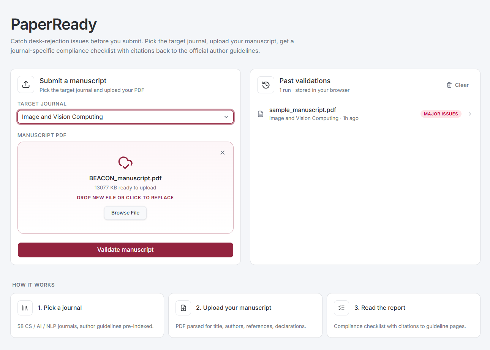
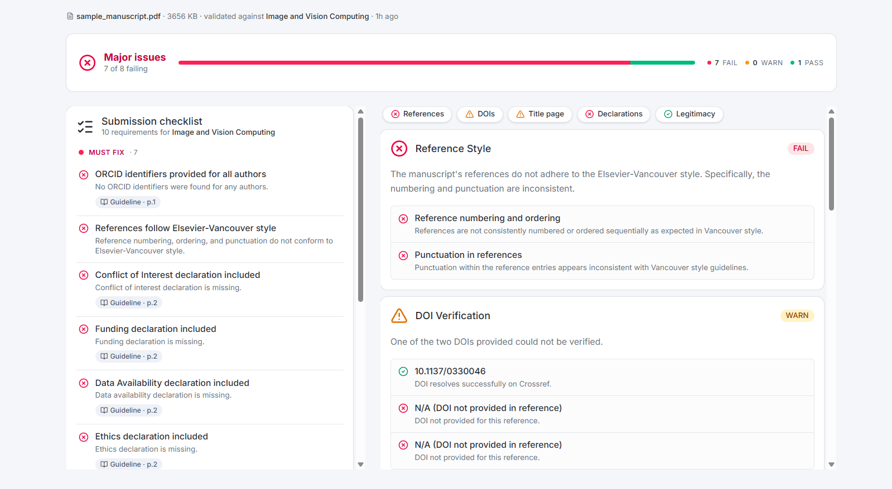

# PaperReady

> An Agentic RAG system that validates academic manuscripts against journal-specific submission requirements.

Researchers preparing a paper must follow many journal-specific rules buried in long author-guideline PDFs: title page format, ORCID, reference style, figure captions, cover-letter format, conflict-of-interest statements, and more. Manual checking is slow and a common cause of desk rejection. PaperReady reads the target journal's author guidelines, the user's manuscript, and a curated rules database, then returns a compliance checklist, a missing-items report, a cover-letter draft, and reference compliance guidance.

<p align="center">
  
  
</p>

## What the pipeline checks

Each validation produces a report with **five compliance categories**, a **journal-style cover letter draft**, and a **flat submission checklist**. The agent calls four tools (`qdrant_search`, `get_reference_rules`, `crossref_verify_doi`, `doaj_lookup`) to gather evidence before producing the report.

### 1. Reference style

Loads the journal's `required_reference_style` (IEEE, Elsevier-Vancouver, APA 7, Harvard, Chicago) and compares the first 5 references against every rule for that style. Concretely:

- Author name format (`Smith JA` vs `Smith, J. A.` vs `J. Smith`)
- Author separator (commas, `and`, ampersand)
- "Et al." threshold (e.g. more than 6 authors for Vancouver)
- Title casing (sentence-case vs title-case) and formatting (italics vs plain)
- Journal name abbreviation rules (NLM, full name, italics)
- Volume / issue / page formatting (e.g. `42(3):123-45` vs `Vol. 42, No. 3, pp. 123-145`)
- Year placement (before or after the journal name)
- DOI inclusion and prefix (`doi:`, `https://doi.org/`)
- Reference type handling (`journal_article`, `conference_paper`, `preprint`, `book`, `book_chapter`)

### 2. DOI verification

For up to 5 DOIs parsed from the bibliography, calls **Crossref REST** to confirm each one resolves to a real record. Catches truncated, mistyped, or hallucinated DOIs that would otherwise slip past peer review.

### 3. Title page

`qdrant_search` retrieves the journal's title-page requirements, then compares against the parsed manuscript:

- Article title presence and length
- Author names and affiliations (with superscript markers)
- Corresponding author flag and contact details
- ORCIDs (regex-detected from the PDF)
- Present / permanent address footnotes
- LaTeX template usage where the journal requires it

### 4. Declarations

`qdrant_search` retrieves declaration requirements. The PDF parser already probes for the four most common, then the agent compares them against what the guideline mandates:

- Conflict of interest / competing interests
- Funding sources and sponsor roles
- Data availability statement
- Ethics statement (IRB approval, animal welfare, human-subjects consent)
- AI-tool usage declaration (some journals now require this)

### 5. Legitimacy

Combines two signals:

- `doaj_lookup(issn)`: confirms the journal is in the Directory of Open Access Journals. An empty result is **not** a red flag, since many reputable subscription journals are not in DOAJ.
- `journal.reputation_flag`: a curated column in `journal_metadata.csv` that surfaces hard concerns (e.g. `delisted_wos_2024` for MTAP).

### Cover letter draft

After the five categories, the agent drafts a 150 to 250 word cover letter that addresses the editor (or a generic "Dear Editor-in-Chief,"), names the manuscript, summarises the contribution from the abstract, justifies fit using the journal's scope, and signs off. The author edits and pastes this into the submission portal.

### Submission checklist

A flat, exhaustive list of every must-have item the target journal expects, each tagged `pass | warn | fail | pending`. Sized to the journal, not a fixed number: ~65 items for TPAMI, ~76 for IVC.

The list is **pre-extracted at ingest time** rather than rediscovered during validation. `ingest/extract_requirements.py` runs one Gemini call over the full guideline PDF and writes the atomic checklist to `ingest/out/requirements/<journal_id>.json`. At run time the agent loads that list from the sidecar and grades every item against the manuscript — so the checklist is exhaustive by construction instead of bounded by what RAG happened to retrieve. Examples from real runs:

- Title page lists all author affiliations
- References follow the journal's required style
- ORCIDs provided for all authors
- Highlights (3 to 5 bullet points) supplied
- Graphical abstract supplied
- Conflict of interest declaration included
- Data availability statement included
- Keywords list (1 to 7 keywords, English) supplied
- LaTeX submission uses the journal's template
- Manuscript submitted via the journal's portal (status: `pending` — can't be checked from the PDF)

### Out of scope (for now)

These are intentionally not part of the pipeline yet. Future iterations could add them:

- Figure resolution / DPI checks
- Word count and section length limits
- Plagiarism / similarity scoring
- Statistical-method validation (CONSORT, ARRIVE, PRISMA)
- Supplementary material packaging
- Anonymisation for double-blind review

## Running locally

### What's already in the repo

You don't need to source any data yourself. The repo ships with everything required for a first run:

- `ingest/out/journal_metadata.csv` (58 curated journals)
- `ingest/out/reference_style_rules.csv` (68 curated style rules)
- `ingest/data/tpami_author_guide.pdf` and `ingest/data/ivc_author_guide.pdf` (the two guideline PDFs to embed)
- `ingest/data/sample_manuscript.pdf` (a Vision Transformer paper to validate against)
- `ingest/out/requirements/tpami.json` and `ingest/out/requirements/ivc.json` (pre-extracted submission checklists, ~65 and ~76 atomic items)
- `n8n/workflows/validate.json` (the agent workflow, ready to import)

### Supported journals

The dropdown is driven by Qdrant. The sidecar's `/journals` endpoint scrolls the `guideline_chunks` collection on every request and returns only the journals that actually have author guidelines indexed, so the UI never offers a journal the agent can't retrieve from. Out of the box that's:

| journal_id | Name | Publisher | Reference style |
|---|---|---|---|
| `tpami` | IEEE Transactions on Pattern Analysis and Machine Intelligence | IEEE | IEEE |
| `ivc` | Image and Vision Computing | Elsevier | Elsevier-Vancouver |

To add more, see [Adding another journal](#adding-another-journal) below.

### Prerequisites

1. **Docker Desktop** for Qdrant and n8n
2. **Node.js 20.9+** for the Next.js frontend
3. **uv** (Python 3.11+) for the sidecar and ingest script
4. A **Google AI Studio API key** (free tier is enough): <https://aistudio.google.com/apikey>
5. A local **n8n instance** running at `http://localhost:5678`

### Step 1. Start Qdrant

```powershell
docker compose -f infra/docker-compose.yml up -d
```

### Step 2. Set your Gemini API key

```powershell
cp ingest/.env.example ingest/.env
```

Then edit `ingest/.env` and set `GOOGLE_API_KEY=AIza...`.

### Step 3. Embed the guideline PDFs into Qdrant

```powershell
uv run --directory ingest python ingest_guideline.py --journal-id tpami --pdf data/tpami_author_guide.pdf
uv run --directory ingest python ingest_guideline.py --journal-id ivc   --pdf data/ivc_author_guide.pdf
```

This produces 235 chunks across the two journals. The script throttles itself for the Gemini free-tier embedding quota, so each PDF takes about 2 minutes.

> **Skip if you don't plan to add new journals.** The repo already ships with `ingest/out/requirements/tpami.json` and `ingest/out/requirements/ivc.json`. If you only want to validate against these two journals, you can jump to Step 4.

If you DO want to refresh or add a new journal's checklist, run the extractor:

```powershell
uv run --directory ingest python extract_requirements.py --journal-id tpami --pdf data/tpami_author_guide.pdf
uv run --directory ingest python extract_requirements.py --journal-id ivc   --pdf data/ivc_author_guide.pdf
```

One Gemini call per journal, ~30 seconds each. Writes to `ingest/out/requirements/<journal_id>.json`.

### Step 4. Start the Python sidecar

```powershell
uv run --directory sidecar uvicorn app.main:app --host 127.0.0.1 --port 8000
```

Leave this running. It serves the CSV lookups at `http://127.0.0.1:8000`.

### Step 5. Import and publish the n8n workflow

In the n8n web UI at `http://localhost:5678`:

1. **Import** `n8n/workflows/validate.json` (Workflows, then "Import from File").
2. **Create a credential**: Credentials, then "New", then `Google Gemini(PaLM) Api`. Paste your `GOOGLE_API_KEY`.
3. **Attach the credential** to both Gemini subnodes inside the workflow (the embedding node and the chat-model node on the Validator Agent).
4. **Publish** the workflow (toggle the Active switch).

### Step 6. Start the frontend

```powershell
cd web
npm install
npm run dev
```

Open <http://localhost:3000>, pick a target journal in the dropdown, drag a manuscript PDF onto the form, and click **Validate**. About 25 seconds later the report appears. The bundled `ingest/data/sample_manuscript.pdf` (a Vision Transformer paper) is a good first test.

### Free-tier rate limits

Each validation calls Gemini 2.5 Flash roughly 7 to 10 times (one initial round, one per tool call, one final synthesis). The free tier caps at 10 requests per minute on Flash, so back-to-back runs from the same key get throttled. For demo use, space validations about 90 seconds apart.

### Adding another journal

1. If the journal is not already in `ingest/out/journal_metadata.csv`, add a row. The minimum useful columns are `journal_id, name, publisher, required_reference_style, issn`. (Restart the sidecar after this edit so the new row is picked up.)
2. Save the author-guide PDF at `ingest/data/<journal_id>_author_guide.pdf`.
3. Embed it into Qdrant:
   ```powershell
   uv run --directory ingest python ingest_guideline.py --journal-id <journal_id> --pdf data/<journal_id>_author_guide.pdf
   ```
4. Extract the pre-built submission checklist:
   ```powershell
   uv run --directory ingest python extract_requirements.py --journal-id <journal_id> --pdf data/<journal_id>_author_guide.pdf
   ```
5. Refresh the frontend. The dropdown queries Qdrant live and the workflow loads the new requirements JSON automatically, so the journal shows up and is fully gradeable as soon as both scripts finish.

## Architecture

```
INGEST TIME (once per journal)
  ingest_guideline.py     ──► Qdrant (3072-dim chunks, journal-filtered)
  extract_requirements.py ──► ingest/out/requirements/<id>.json (atomic checklist)

RUN TIME (per validation)
  [Next.js frontend]   upload PDF + pick journal
          │
          ▼  POST /webhook/validate  (multipart: pdf + journal_id)
  [n8n Validator Agent (Gemini 2.5 Flash)]
          │   one workflow:
          │     webhook → Extract from File → Parse Manuscript (JS Code)
          │     ┊                                          │
          │     └─ HTTP → /journals/{id} → /requirements/{id} → Merge ─┐
          │                                                            ▼
          │                                                Validator Agent + 4 tools
          │                                                            │
          │                                                Clean Output → Respond
          │
          ├──► Qdrant     (235 author-guideline chunks across tpami + ivc)
          ├──► Crossref   (DOI verification, agent tool)
          ├──► DOAJ       (journal legitimacy, agent tool)
          └──► Sidecar    (/journals, /reference-rules/{style}, /requirements/{id})
```

Two phases:

1. **Ingest time** (once per journal). `ingest_guideline.py` embeds chunks into Qdrant for semantic lookups; `extract_requirements.py` makes one Gemini call over the whole PDF and writes a flat, atomic checklist to disk.
2. **Run time** (every validation). The n8n workflow fetches journal metadata + the pre-extracted checklist, runs the agent, which grades every checklist item against the parsed manuscript. The agent's tools (`qdrant_search`, `get_reference_rules`, `crossref_verify_doi`, `doaj_lookup`) are used sparingly, only when a single requirement needs context to grade.

The whole agent pipeline lives in a single n8n workflow. The Python sidecar is a small FastAPI service serving CSV and requirements-JSON lookups. Next.js is the UI shell.

## Tech stack

| Layer | Choice |
|---|---|
| Agent orchestration | n8n (self-hosted Docker, v2.20) |
| LLM (chat) | Gemini 2.5 Flash via Google AI Studio |
| Embeddings | `gemini-embedding-001`, 3072 dims |
| Vector DB | Qdrant v1.11 (Docker) |
| External APIs | Crossref REST, DOAJ REST |
| Manuscript PDF parsing | n8n `Extract from File` + JS `Code` node |
| Guideline PDF ingest | Python (`pypdf` + `langchain-text-splitters`) |
| Structured CSV lookups | Python sidecar (FastAPI) |
| Frontend | Next.js 16 (App Router) + Tailwind 4 + React 19 |

## Repo layout

```
paper-ready/
├── docs/
│   ├── IMPLEMENTATION.md          # Build plan + task checklist
│   ├── design/                    # Per-component design docs
│   └── MIDTERM - Team11 ...pdf    # Original proposal deck
├── infra/
│   └── docker-compose.yml         # Qdrant container
├── ingest/
│   ├── data/                      # Source PDFs (author guides + sample manuscript)
│   ├── out/
│   │   ├── journal_metadata.csv   # 58 curated journals
│   │   ├── reference_style_rules.csv  # 68 curated style rules
│   │   └── requirements/          # Pre-extracted per-journal submission checklists
│   ├── ingest_guideline.py        # PDF to chunks to Qdrant (throttled for free tier)
│   └── extract_requirements.py    # Full guideline to atomic checklist via Gemini (1 call)
├── sidecar/                       # FastAPI service for the agent + frontend
│   └── app/
│       ├── main.py                # GET /journals, /journals/{id}, /reference-rules/{style}, /requirements/{id}
│       └── data.py                # CSV loaders + Vancouver style aliases + requirements loader
├── n8n/workflows/
│   ├── validate.workflow.ts       # n8n SDK source (TypeScript)
│   ├── validate.json              # Exported workflow (for import into n8n)
│   └── parse_manuscript.js        # Manuscript parser JS (embedded in workflow)
└── web/                           # Next.js 16 frontend
    ├── app/
    │   ├── page.tsx               # Upload form + report rendering
    │   └── api/
    │       ├── journals/route.ts  # Proxies sidecar /journals
    │       └── validate/route.ts  # Proxies n8n /webhook/validate
    └── components/
        ├── JournalSelect.tsx, UploadForm.tsx
        └── report/                # VerdictBanner, CategoryCard, EvidencePill
```

## Data

Two curated CSVs sit in [ingest/out/](ingest/out/). Both have been externally fact-checked.

### [journal_metadata.csv](ingest/out/journal_metadata.csv), 58 journals

Scope: Computer Science, AI, CV, NLP, ML, Robotics, Data. Columns: `journal_id, name, publisher, scope_keywords, impact_factor_jcr2023, avg_review_time_weeks, apc_if_open_access_usd, open_access_status, required_reference_style, issn, homepage_url, reputation_flag`.

- `journal_id` is a curated kebab-case slug used as the public identifier (URLs, dropdowns, Qdrant filters, tool args).
- `issn` is the rename-proof stable identifier.
- `reputation_flag` surfaces credibility concerns (e.g., `delisted_wos_2024` for MTAP).

### [reference_style_rules.csv](ingest/out/reference_style_rules.csv), 68 rules

Covers APA 7, IEEE, Vancouver, Harvard, and Chicago. Columns: `rule_id, style_name, reference_type, element_type, rule_attribute, rule_value, example, notes`.

- `reference_type` distinguishes `journal_article`, `conference_paper`, `preprint`, `book`, `book_chapter`. This matters for AI/CV/NLP papers that cite arXiv and conferences heavily.
